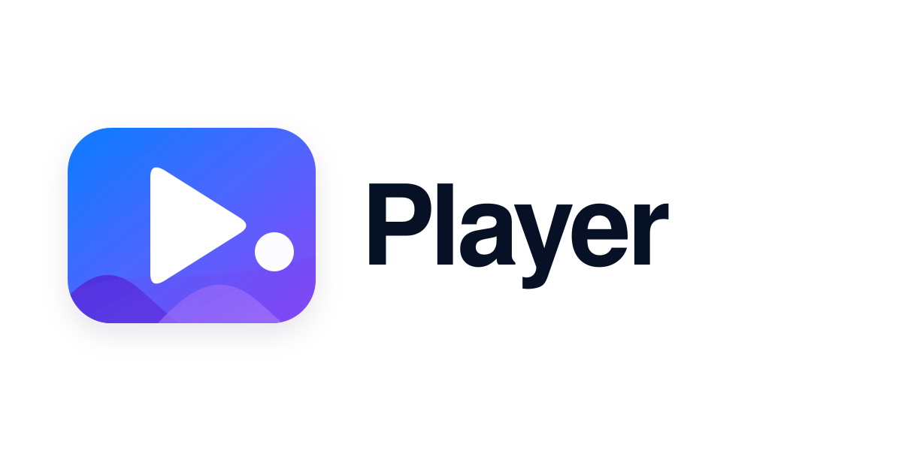

player
======

Player is an opinionated, self-hosted web media player designed around the KISS principle: minimal dependencies, no frontend frameworks, keyboard-first navigation. Built with Go, SQLite, and vanilla JavaScript.

Features
--------

### Media Playback

- **Videos** — streaming with seek (range requests), optional remuxing, thumbnail previews
- **Images** — lightbox viewer with zoom, slideshow mode, and pan support
- **Audio / Audiobooks** — cover art display, progress tracking (resumes where you left off)
- **Podcasts** — subscribe to RSS/Atom feeds, download episodes to the server, mark listened/unlistened

### Organization

- **Sets** — media is grouped into sets (one subdirectory of `MEDIA_ROOT` per set)
- **Folder browsing** — navigate subfolders within a set via breadcrumbs
- **Tags** — add and remove tags on any media item; filter by tag
- **Favorites** — mark items as favorites; filter to favorites-only view
- **Notes** — attach personal notes to any media item
- **Search** — full-text search with query syntax: `min:30`, `tag:a,b`, `like:1`, `type:video`, `sort:random`, `minsize:10`, etc.
- **Shuffle** — randomize playback of the current filtered result set

### Sharing & Access

- **Share links** — generate time-limited share links for any media item (no login required for recipients)
- **User accounts** — multi-user with login, session cookies, and logout
- **RBAC permissions** — per-set `owner` and `viewer` roles; admins see everything implicitly
- **Admin panel** — create/delete users, manage permissions, trigger library rescans, manage trash

### Integrations

- **Podcast feed manager** — add feeds via URL, automatic background refresh with conditional GET
- **File upload** — upload media directly to a set from the browser
- **Library scanner** — `ffprobe`-backed metadata extraction and automatic thumbnail generation
- **PWA** — installable as a Progressive Web App (`manifest.json` + service worker)
- **Detached player** — pop out the player into its own window for multitasking

### Theming

- Dark and light themes with CSS custom properties
- Theme preference saved to `localStorage`
- Easy to add custom themes via `data-theme` attribute selectors

### Keyboard-First

Full vim-friendly keyboard navigation — disabled automatically when typing in inputs. See [Keyboard Shortcuts](docs/keyboard-shortcuts.md) for the full reference.

### Tech Stack

- **Backend:** Go 1.23, `net/http` stdlib, SQLite (`modernc.org/sqlite`), bcrypt
- **Media processing:** `ffmpeg` / `ffprobe` (in container)
- **Frontend:** Vanilla JS (ES modules), CSS custom properties, no build step
- **Container:** Alpine-based Docker image, runs as non-root (UID 65534)

Documentation
-------------

| Document | Description |
|----------|-------------|
| [Quick Start](docs/quick-start.md) | Running from source, Docker, Kubernetes, mage targets |
| [Configuration](docs/configuration.md) | Environment variables and defaults |
| [API Reference](docs/api.md) | Full REST API endpoint listing |
| [Keyboard Shortcuts](docs/keyboard-shortcuts.md) | All key bindings and search syntax |
| [Theming](docs/theming.md) | Theme system and adding custom themes |
| [Podcast Support](docs/podcasts.md) | Subscribing, episode management, feed checker |
| [Admin Guide](docs/admin.md) | Users, permissions, rescans, trash |