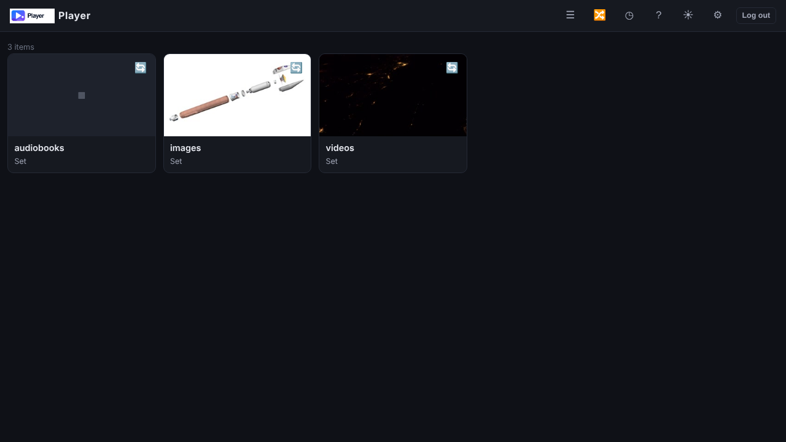
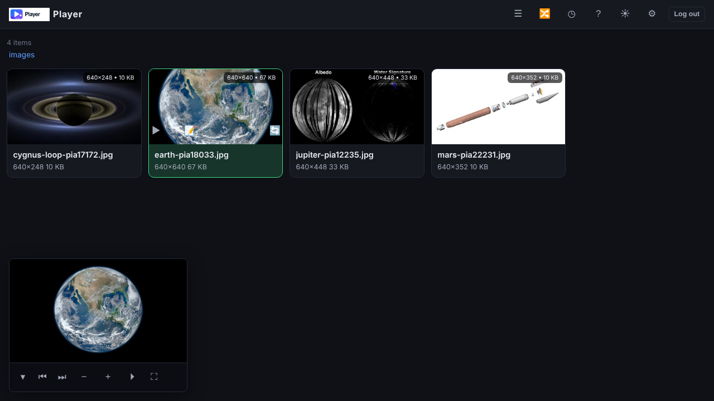
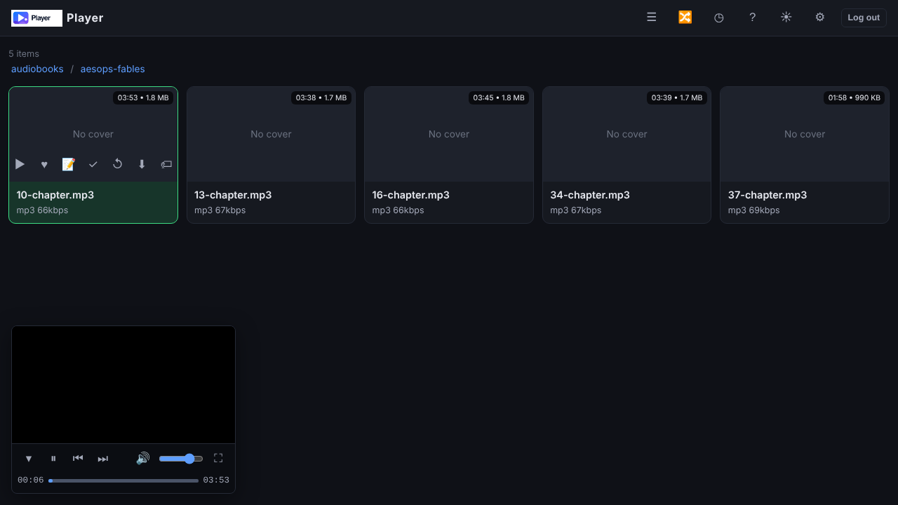

# Player

Player is a self-hosted media player split into a Go server and a Flutter Android client. The server owns the web UI, media library, playback APIs, accounts, and storage; the Android project is the mobile client scaffold that targets the same REST API. This repository is the monorepo root after the split, so start here for orientation and then work in the component directory that matches the change.

## Screenshots

Web UI (served by `player-server`):

| Library | Image viewer | Audio playback |
| --- | --- | --- |
|  |  |  |

Android client (`player-android`):

| On this device | Empty library | Audio player |
| --- | --- | --- |
|  |  |  |

## Repository Layout

```text
player-server/   Go server, web UI, API, docs, deployment files
player-android/  Flutter Android client scaffold
```

## Server

The server lives in [player-server/](player-server/) and has its own [README](player-server/README.md).

Build hint: `cd player-server && mage build`

Use the server README and docs for configuration, API behavior, keyboard shortcuts, Docker, Kubernetes, and development workflow.

## Android

The Android client lives in [player-android/](player-android/) and has its own [README](player-android/README.md).

Build hint: `cd player-android && flutter analyze && flutter build apk --debug`

The Flutter project is intentionally small for now. Keep Android client changes aligned with the server API documentation in [player-server/docs/api.md](player-server/docs/api.md).

## Working From The Root

Root files provide monorepo orientation only. Component-specific commands, generated files, local databases, media samples, and build outputs belong under their component directories.

Keep local media and generated build artifacts out of git.

## License

MIT; see [LICENSE](LICENSE).
