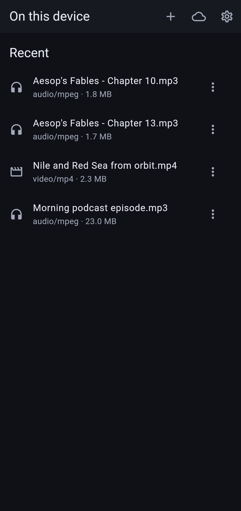
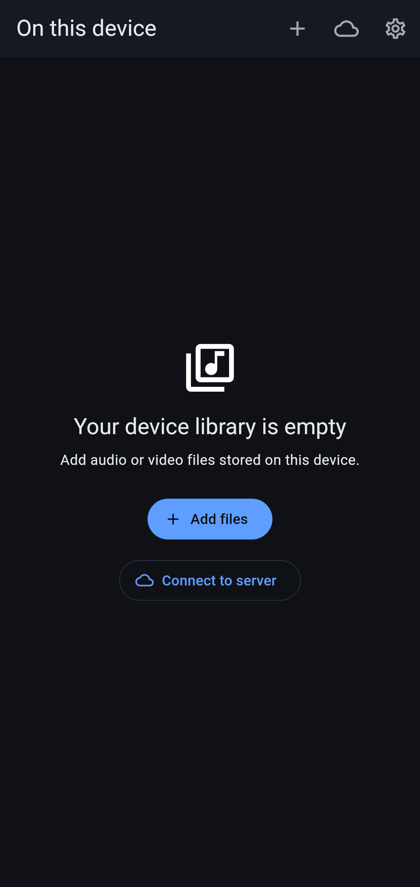
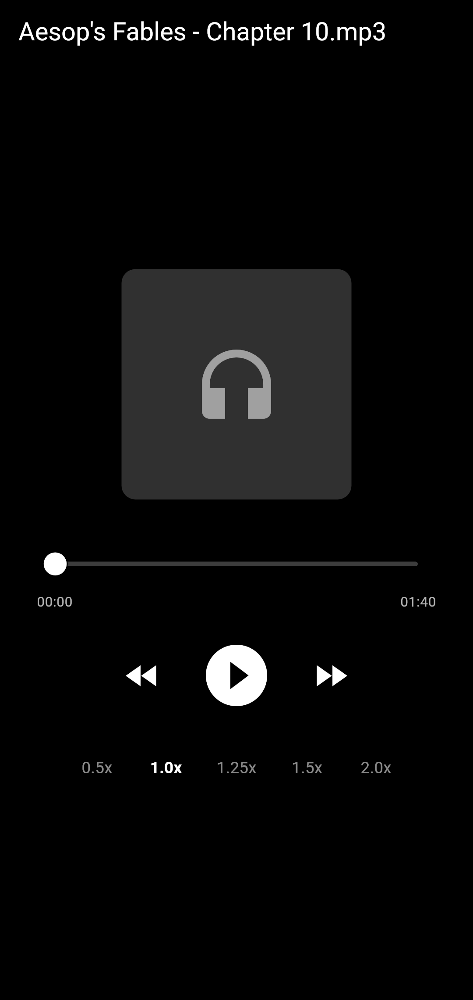

# Player Android

Android audio/video player for device files and the Player server.

The installed app version and build number appear at the bottom of **Settings**.

## Screenshots

| On this device | Empty library | Audio player |
| --- | --- | --- |
|  |  |  |

## Play files on this device

A fresh install opens **On this device**. No server, account, or network
connection is needed. Tap **Add files**, choose audio or video, then select a
file in Android's document picker. Tap its library entry to play it again.

Player retains permission to read the selected document and stores its resume
position locally. It does not copy the file. Audio keeps playing after Back or
Home, with Android notification and lock-screen controls. Video saves progress
when leaving the player or putting the app in the background. Replaying a
finished item starts from the beginning. Force-stopping the app can lose
progress since the last save.

Use an entry's menu for **Choose file again** or **Remove from library**.
Removal stops that item if it is playing and removes its local history and
retained permission; the original file stays on your device. If a file moves,
becomes unreadable, or cannot be decoded, the player may show **Retry**. Return
to the library to choose a replacement or remove the entry.

Formats depend on Android's decoders. MP3 audio and H.264/AAC MP4 video were
verified with the normal app on Android 14/API 34 using the Downloads provider.
Physical devices, other document providers, and removable storage have not
been verified. See the [verification results](docs/standalone-playback-verification.md)
for the exact platform checks and automated coverage.

Folder scanning, playlists, server downloads, local tags/notes, and syncing local
history across devices are outside this feature.

## Connect to a server

Tap **Connect to server**, enter the server origin, and save it. Create the first
admin account if the server is new, or sign in to an existing account. The server
library retains streaming, server progress, and public shares. Open **On this
device** from the server navigation menu to return to local files.

Switching libraries stops the current playback session. Browsing away from the
audio player within the same library keeps audio playing. Local settings remain
available without a connection. Server logout or expired credentials preserve
local files and history; a delayed server error cannot stop a local session.

## SVG images

SVG files from the server are shown in the image viewer and as thumbnails.
The app accepts simple vector drawings only and treats every SVG as
untrusted, because one can arrive through a public share link.

Supported: paths and basic shapes, groups, gradients, clip paths, `<use>`
of plain content, and short text. Not supported, and shown as "Image
unavailable" instead of being drawn wrongly: style sheets, patterns,
embedded bitmaps, masks, filters, dashed strokes, blend modes, markers,
symbols, animation, references outside the file, and drawings beyond the
size and complexity budgets in `lib/services/svg_limits.dart` (for example
more than 2,000 elements, 256 KB of path data or 1 MB in total).

A drawing is turned into a bitmap once, sized for the place it is shown in
and never larger than 2048 pixels a side. Zooming in the viewer enlarges
that bitmap; it does not redraw the vectors.

Making the bitmap is the only expensive step, and it is bounded: the app
counts the drawing operations of a file (fills, strokes, gradients, layers,
characters of text, and how often outlines cross the drawing) and chooses
the bitmap so that operations times pixels stays within a fixed budget. A
drawing with many operations is therefore shown at a lower resolution, down
to 256 pixels, and one that is over budget even then (about 4,600
operations) is not shown.

With the software rasteriser used by `flutter test`, which is slower than a
phone's GPU, the budget corresponds to between half a second and a second.
The most expensive accepted case in
`test/services/svg_hostile_input_test.dart`, 970 oversized glyphs, took
0.55 to 0.75 s for a full-screen bitmap and 0.1 s for a list thumbnail; 51
full-screen repeating radial gradients at full resolution took 0.5 to
0.65 s. That time is spent once per drawing and size.

## Quickstart

When Flutter is installed, finish or refresh the generated Android project files:

```sh
cd player-android
flutter create --org zone.foo --project-name player_android --platforms=android --description 'Player Android client' .
flutter analyze
flutter test
flutter build apk --debug
```

The REST API contract lives in [../player-server/docs/api.md](../player-server/docs/api.md).

The [standalone local playback design](docs/standalone-local-player.md) records
the implemented scope and its acceptance results.

## Install from F-Droid

Add the [snonux F-Droid repository](https://github.com/snonux/fdroid) to the
F-Droid app, then install Player. Releases contain separate APKs for
armeabi-v7a, arm64-v8a, and x86_64, so each device downloads only its ABI.

Releases are built from `vX.Y.Z` tags by
[`release.yml`](../.github/workflows/release.yml). The tag must match the
version name in `pubspec.yaml`; increment its build number for every release.
The APKs use the release keystore supplied through GitHub Actions secrets.
See [the release setup guide](docs/fdroid-release.md) for the one-time setup.

To build the same split APKs locally:

```sh
flutter build apk --release --split-per-abi
```

Without `android/key.properties`, local release builds use the debug key and
cannot update an app installed from F-Droid.
The published APK does not claim a public share-link host. Enter your own
server address in Settings after installation.

## Share links on Android

Build with `--dart-define=PLAYER_BASE_URL=https://player.example.com` to register
that server's `/s/{token}` share links as Android VIEW intents. The default
debug build registers `http://10.0.2.2:8080` for the local emulator server.
The app always loads public shares from the build-time origin, even if the
server address in Settings changes later. A new build is needed to claim links
for a different hostname or scheme; a non-default explicit port is matched
exactly. The default HTTP and HTTPS ports are normalized to match generated
share URLs without an explicit port.
If Android forwards a link with the same host but a different port, the app
shows a server-mismatch message before sending the share token anywhere.

The VIEW filter makes the app eligible to handle matching links. Automatic
opening on Android 12+ requires the HTTPS server to publish a matching
`/.well-known/assetlinks.json` for the app's signing certificate, or the user
to enable supported links for the app in Android settings. Without verification,
ordinary taps may open the browser. The Player server does not currently
publish this file.
